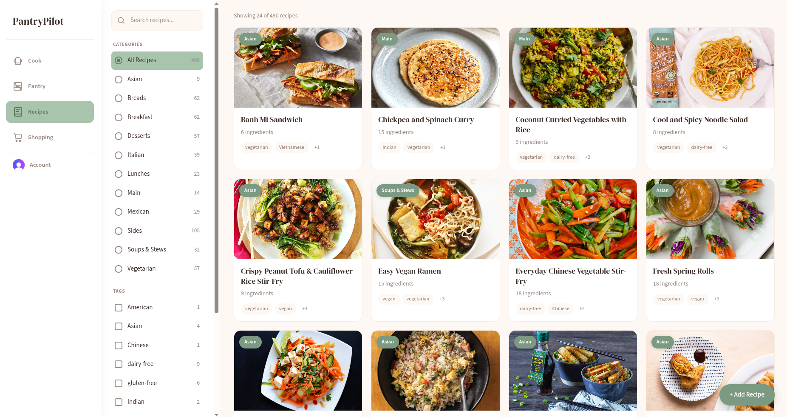
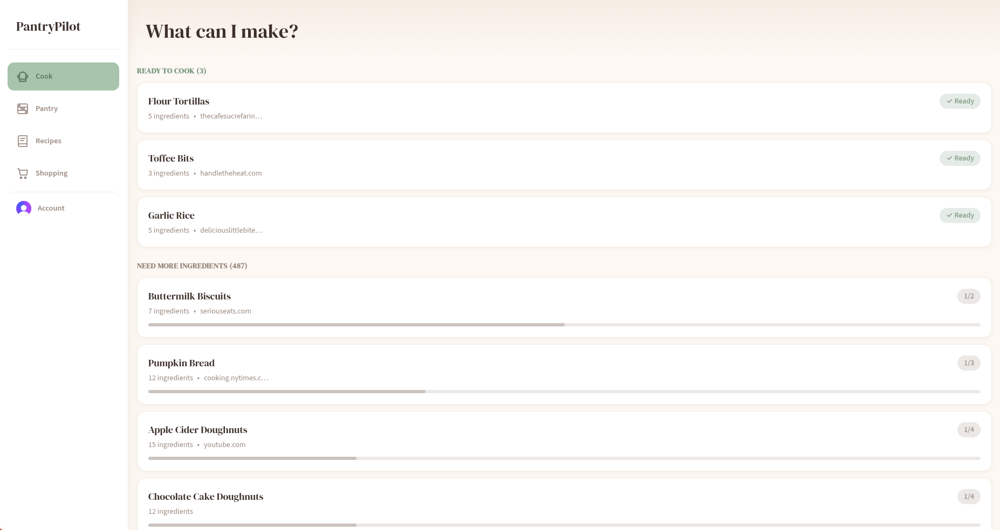
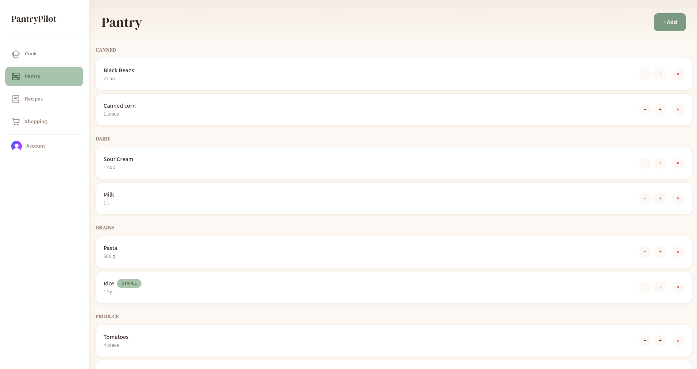
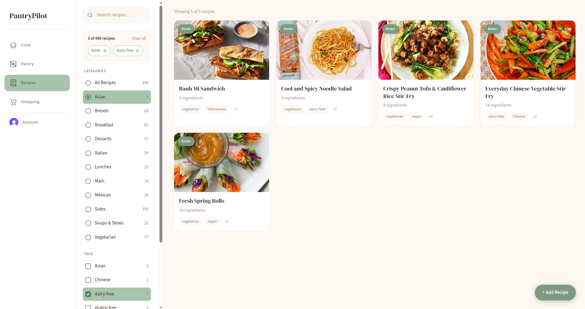
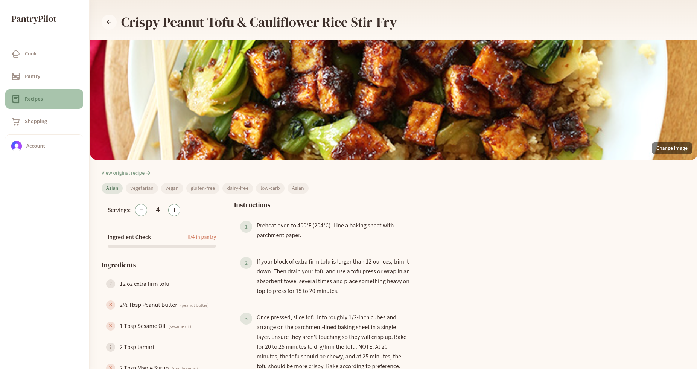
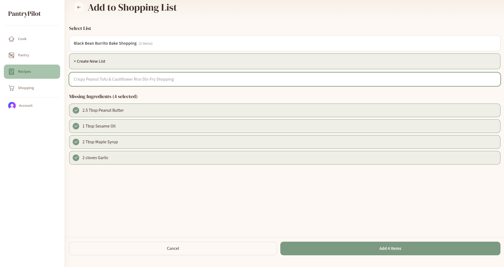
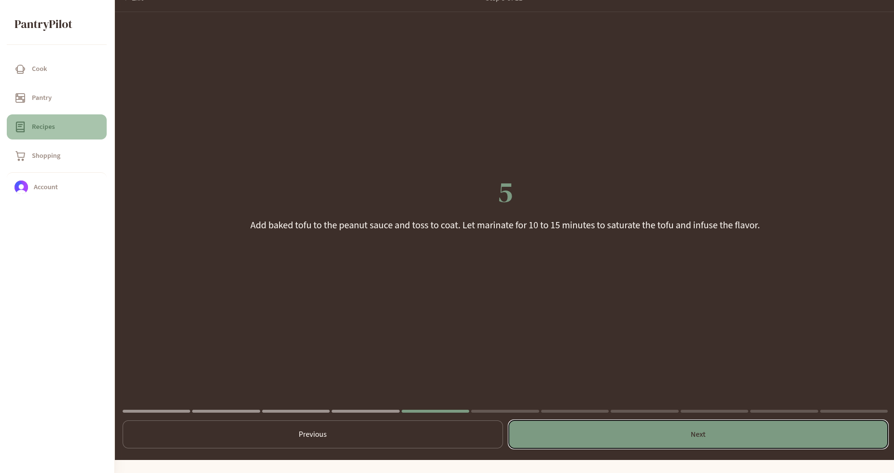
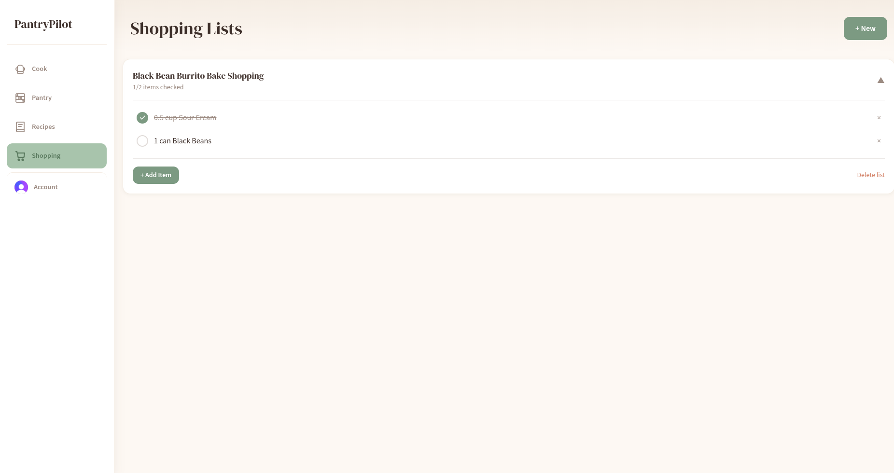

# PantryPilot

A modern kitchen companion app for managing your pantry, recipes, and shopping lists. Built with React, Convex, and Clerk authentication.



**[Live Demo](https://pantrypilot.szczesny.dev/)** — try it with `demo@pantrypilot.app` / `demopantry`

<details>
<summary>Screenshots</summary>

### What Can I Make?


### Pantry


### Recipe Browser


### Recipe Detail


### Ingredient Checklist


### Add to Shopping List


### Step-by-Step Cooking


### Shopping Lists


</details>

## Features

### What Can I Make?

The home screen analyzes your pantry against your recipe collection and shows you:
- **Ready to Cook** - recipes where you have all ingredients
- **Almost Ready** - recipes missing just a few items
- **Need More Ingredients** - recipes to plan for later

### Pantry Management

- Track ingredients in your pantry with quantities and units
- Smart unit conversion between metric and imperial
- Categorized ingredient organization

### Recipe Management

- Import recipes from any URL using AI-powered extraction
- Manual recipe entry with plain text ingredients and steps
- Scale recipes by adjusting servings
- Step-by-step cooking mode
- Automatic pantry deduction after cooking
- Category and tag organization

### Shopping Lists

- Create multiple shopping lists
- Add missing recipe ingredients with one click
- Check off items as you shop
- Move purchased items directly to pantry

### User Accounts

- Secure authentication via Clerk (Google, email, etc.)
- Private data per user
- Account management and deletion

## Tech Stack

- **Frontend**: React 19, TanStack Router, TanStack Start (SSR)
- **Backend**: Convex (real-time database)
- **Authentication**: Clerk
- **Styling**: Tailwind CSS
- **Recipe Import**: OpenRouter AI

## Installation

### Prerequisites

- Node.js 22+
- [Convex](https://convex.dev) account (free tier or self-hosted)
- [Clerk](https://clerk.com) account (free tier available)
- (Optional) [OpenRouter](https://openrouter.ai) API key for AI recipe import

### Setup

1. **Clone the repository**

   ```bash
   git clone https://github.com/lukasz-sz96/pantrypilot.git
   cd pantrypilot
   ```

2. **Install dependencies**

   ```bash
   npm install
   ```

3. **Configure Clerk**
   - Create a new Clerk application at [clerk.com](https://clerk.com)
   - Enable Google OAuth (or other providers) in SSO Connections
   - Create a JWT template: JWT Templates → Convex
   - Copy the Issuer URL (e.g., `https://your-app.clerk.accounts.dev`)

4. **Configure Convex**

   ```bash
   npx convex dev
   ```

   This will prompt you to create a new Convex project and generate your `VITE_CONVEX_URL`.

5. **Set Convex environment variables**

   In [Convex Dashboard](https://dashboard.convex.dev) → Settings → Environment Variables, add:

   | Variable | Required | Description |
   |----------|----------|-------------|
   | `CLERK_JWT_ISSUER_DOMAIN` | Yes | Clerk JWT Issuer URL |
   | `OPENROUTER_API_KEY` | No | For AI recipe import |
   | `OPENROUTER_MODEL` | No | Defaults to `google/gemini-2.0-flash-001` |

6. **Set up local environment**

   ```bash
   cp .env.example .env
   ```

   Fill in your `.env` file:

   ```env
   VITE_CONVEX_URL=https://your-deployment.convex.cloud
   VITE_CLERK_PUBLISHABLE_KEY=pk_test_...
   ```

7. **Run development server**

   ```bash
   npm run dev
   ```

   The app will be available at `http://localhost:3000`

### Docker Deployment

Uses [Convex](https://convex.dev) for the backend (free tier or self-hosted).

#### Prerequisites

1. Complete the setup steps above (Convex project + Clerk configuration)
2. Deploy Convex: `npx convex deploy`

#### Quick Start

```bash
docker run -d \
  -p 3000:3000 \
  -e CONVEX_URL=https://your-project.convex.cloud \
  -e CLERK_PUBLISHABLE_KEY=pk_test_... \
  ghcr.io/lukasz-sz96/pantrypilot:latest
```

#### Environment Variables

| Variable                | Required | Description                                                  |
| ----------------------- | -------- | ------------------------------------------------------------ |
| `CONVEX_URL`            | Yes      | Convex Cloud URL (e.g., `https://your-project.convex.cloud`) |
| `CLERK_PUBLISHABLE_KEY` | Yes      | Clerk publishable key                                        |

#### Unraid

Add container with:

- **Repository**: `ghcr.io/lukasz-sz96/pantrypilot:latest`
- **Port**: 3000 → your choice
- **Variables**: `CONVEX_URL`, `CLERK_PUBLISHABLE_KEY`

## Project Structure

```
├── convex/              # Convex backend (schema, queries, mutations, actions)
├── src/
│   ├── components/      # React components
│   ├── lib/             # Utilities (cooklang parser, unit conversion)
│   ├── routes/          # TanStack Router pages
│   └── styles/          # CSS styles
└── Dockerfile
```

## License

GPL v3
